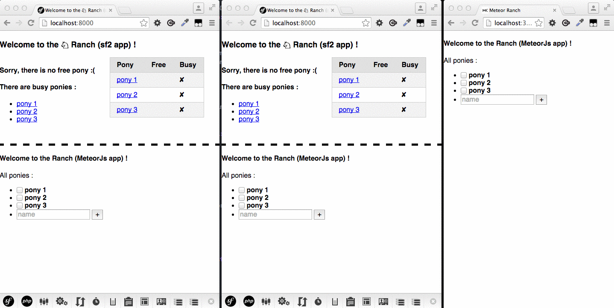
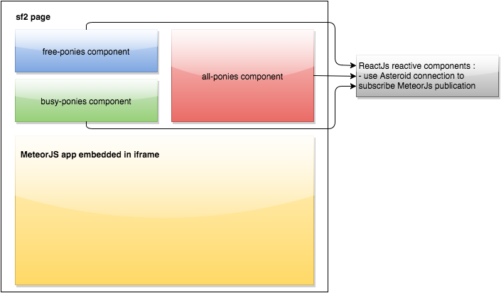

# How to easily add realtime on your app (symfony2 + meteorjs + reactjs example)





## Technologies
- symfony2 (or whatever) to serve the website/app
- MeteorJs to easily publish reactive data
- ReactJs to easily build reactive components
- Asteroid to subscribe to the meteor publications from reactive components
- MongoDb to store data

## Main Principes
- Meteor app and website/app share data on MongoDb
- Meteor app publish data
- client browser call the website/app
- the website/app response a static page to the client with needed reactive components and Asteroid connection to Meteor app
- each components subscribe to needed publication
- MeteorJs detect when something is added/changed/removed in MongoDb (from website/app or Meteor app or any MongoDb client) and publish it
- reactive components (on client browser) refresh data

## Requirements
- PHP >= 5.4 / Composer
- MeteorJs (which integrates MongoDb)
- MongoDb driver for PHP (see http://php.net/manual/fr/mongo.installation.php)

## Installation
```
$ git clone git@github.com:Elao/symfony2-meteorjs-reactjs-example.git
$ cd symfony2-meteorjs-reactjs-example
$ composer install
```

## Run
Start website/app with php built-in server :
```
$ app/console server:run
Server running on http://127.0.0.1:8000

Quit the server with CONTROL-C.
```

Start Meteor app (dev mode) :
```
$ cd var/realtime && meteor
[[[[[ /home/yoh/src/symfony2-meteorjs-reactjs-example/var/realtime ]]]]]

=> Started proxy.
=> Started MongoDB.
=> Started your app.

=> App running at: http://localhost:3000/
```

Go to http://127.0.0.1:8000 !
